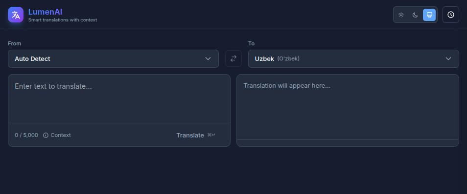

# 🌐 LumenAI Translate

> **More than just words.** A smart, context-aware translator that understands nuance, slang, and multiple meanings.
> **Avaible on** https://lumenai-translate.vercel.app/


## ✨ Features



### 🧠 Dual-Model Intelligence
We use the right brain for the job:
*   **For Vocabulary (1-4 words)**: Uses **Llama 3.1 70B (via Groq)** to provide rich, dictionary-style definitions with visual emojis, pronunciation guides, and usage examples.
*   **For Sentences (5+ words)**: Automatically switches to **Gemini 1.5 Flash** for rapid, fluent, and accurate full-text translation.

### 🎧 Audio & Voice Features
*   **Speech-to-Text (STT)**: Speak directly into the app using Chrome/Edge's native speech recognition.
*   **Smart Text-to-Speech (TTS)**:
    *   **Native Accent Force**: Automatically detects and forces the *correct* regional voice (e.g., German voice for German text) to fix accent issues.
    *   **Intelligent Reading**: For vocabulary words, it reads *only* the headword (e.g., "Überraschung") and ignores the grammar metadata.
    *   **Voice Quality**: Prioritizes high-quality Google/Microsoft neural voices if available.

### 🎯 Precision Logic
*   **Strict Language Enforcement**: Prevents "false friend" errors. If you select **German** but type "Gift" (which exists in English too), it forces the AI to treat it as German ("Poison") instead of guessing English ("Present").

### 🚀 Key Capabilities
*   **📚 Smart Dictionary**: Don't just get a word; get the *meaning*. See synonyms, parts of speech, and example sentences.
*   **🎭 Context-Aware**: Add optional context (e.g., "formal email", "slang", "medical") to get the perfect tone.
*   **📱 Installable App (PWA)**: Add to your mobile home screen and use it like a native app.
*   **⚡ Blazing Fast**: Powered by Groq's LPU inference engine for instant vocabulary lookups.
*   **🎤 Audio Support**: Speech-to-Text inputs and Text-to-Speech output with smart accent detection.
*   **🎨 Beautiful UI**: Glassmorphism design with full Dark Mode support and smooth animations.
*   **💾 History**: Automatically saves your translations locally so you never lose them.

## 🛠️ Getting Started

### Prerequisites
*   Node.js 18+
*   npm or yarn
*   API Keys for [Groq](https://console.groq.com/) and [Gemini](https://aistudio.google.com/app/apikey)

### Installation

1.  **Clone the repository**
    ```bash
    git clone https://github.com/doniyor117/lumenai_translate.git
    cd lumenai_translate
    ```

2.  **Install dependencies**
    ```bash
    npm install
    ```

3.  **Configure Environment**
    Create a `.env.local` file in the root directory:
    ```env
    # Groq API Key (for rich vocabulary)
    GROQ_API_KEY=gsk_your_groq_key_here

    # Gemini API Key (for sentences - Free Tier available)
    GEMINI_API_KEY=your_gemini_key_here
    ```

4.  **Run the development server**
    ```bash
    npm run dev
    ```

    Open [http://localhost:3000](http://localhost:3000) with your browser.

## 📱 How to Install on Mobile

This app is a Progressive Web App (PWA).

*   **iOS**: Open in Safari → Tap 'Share' → Select 'Add to Home Screen'.
*   **Android**: Open in Chrome → Tap menu (⋮) → Select 'Install app'.

## 🤝 Contributing

Contributions are welcome! Please feel free to submit a Pull Request.

## 📄 License

This project is licensed under the MIT License - see the LICENSE file for details.
