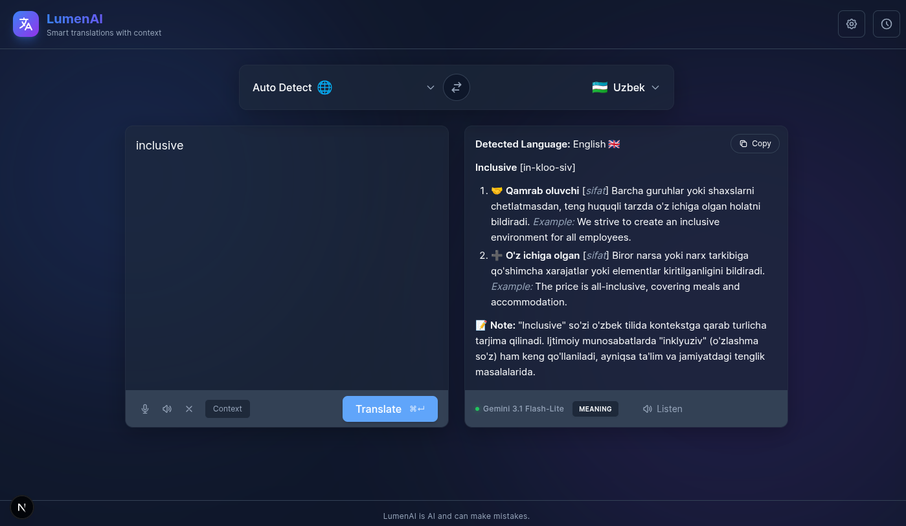

# 🌐 LumenAI Translate

> **More than just words.** A smart, context-aware translator that understands nuance, slang, and multiple meanings.

> **LIVE ON** https://lumenai-translate.vercel.app/


## ✨ Features



### 🧠 3 Intelligent Translation Modes
LumenAI doesn't just do 1-to-1 translation. Choose the mode that fits your exact need:
*   **📚 Meaning (Dictionary) Mode**: Perfect for single words or short phrases. Provides rich dictionary-style definitions, parts of speech, synonyms, pronunciation guides, and visual emojis to help you grasp the true nuance.
*   **⚡ Direct Mode**: Fast, pure, native-sounding translation. Ideal for sentences, paragraphs, or when you just need the text translated accurately without extra fluff.
*   **🔍 Reverse Lookup**: Forgot a word? Describe it! Type "a place where you borrow books" and LumenAI will instantly find the target word for you (e.g., "Library") in your chosen language.

### ⚙️ Customizable AI Engines
Take full control over the AI powering your translations. You can mix and match models for different modes!
*   **Groq Inference Engine**: Blazing fast models including **Llama 3.3 70B**, **Llama 4 Scout**, and **Qwen 3**.
*   **Google AI**: Powerful models including **Gemini 3.1 Flash-Lite** and **Gemma 4**.

### 🎧 Audio & Voice Features
*   **Speech-to-Text (STT)**: Speak directly into the app using native browser speech recognition.
*   **Smart Text-to-Speech (TTS)**:
    *   **Native Accent Force**: Automatically detects and forces the *correct* regional voice (e.g., French voice for French text) to ensure perfect pronunciation.
    *   **Intelligent Reading**: In Meaning or Reverse mode, the AI smartly reads *only* the translated words/headwords, skipping the grammar metadata and markdown formatting.
    *   **Voice Quality**: Prioritizes high-quality Google/Microsoft neural voices if available on your device.

### 🎯 Precision Logic
*   **Auto-Detect Mastery**: Automatically identifies the input language and adapts its translation rules perfectly.
*   **Strict Language Enforcement**: Prevents "false friend" errors. If you explicitly select **German** but type "Gift" (which exists in English too), it forces the AI to treat it as German ("Poison") instead of guessing English ("Present").
*   **🎭 Context Button**: Add optional context notes (e.g., "formal email", "Gen Z slang", "medical document") to get the exact tone you need.

### 🚀 Key Capabilities
*   **🎨 Beautiful Glassmorphic UI**: Minimalist, elevated UI components with smooth animations and dark mode support that looks gorgeous on any device.
*   **📱 Installable App (PWA)**: Add to your mobile home screen and use it like a native iOS or Android app.
*   **💾 Local History**: Automatically saves your translations locally so you never lose your vocabulary lists.

## 🛠️ Getting Started

### Prerequisites
*   Node.js 18+
*   npm or yarn
*   API Keys for [Groq](https://console.groq.com/) and/or [Gemini](https://aistudio.google.com/app/apikey)

### Installation

1.  **Clone the repository**
    ```bash
    git clone https://github.com/doniyor117/lumenai_translate.git
    cd lumenai_translate
    ```

2.  **Install dependencies**
    ```bash
    npm install
    ```

3.  **Configure Environment**
    Create a `.env.local` file in the root directory. You can use one or both:
    ```env
    # Groq API Key
    GROQ_API_KEY=gsk_your_groq_key_here

    # Gemini API Key 
    GEMINI_API_KEY=your_gemini_key_here
    ```

4.  **Run the development server**
    ```bash
    npm run dev
    ```

    Open [http://localhost:3000](http://localhost:3000) with your browser.

## 📱 How to Install on Mobile

This app is a fully functional Progressive Web App (PWA).

*   **iOS**: Open in Safari → Tap 'Share' → Select 'Add to Home Screen'.
*   **Android**: Open in Chrome → Tap menu (⋮) → Select 'Install app'.

## 🤝 Contributing

Contributions are welcome! Please feel free to submit a Pull Request.

## 📄 License

This project is licensed under the MIT License - see the LICENSE file for details.
